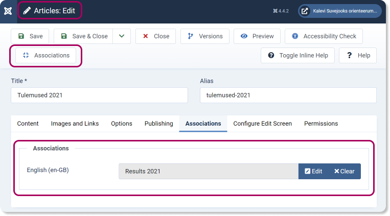

## **WIP**

# Template

## Uus **Child Template**

Uus **Child Template** Cassiopeia põhjal: Cassiopeia_cassiopeia_for_lsf

**Templates: Styles (Site)** : cassiopeia_for_lsf_style on määratud kui **Default for all pages**.

## _Template_'i stiil

Tegin kausta `/media/templates/site/cassiopeia_cassiopeia_for_lsf/css` faili `user.css`. 

Joomla/Cassiopeia laevad lehe kõigepealt vaikimisi stiilidega ning siis rakendavad sinna otsa `user.css` failis kirjeldatu.

Praeguse seisuga on seal tavapärasega võrreldes muudetud:
* Lehe värvid
* Päise formaat (**Content > Site Modules > P2isepilt** asukohaga **topbar**, **Layout: banner**)

# Värvid

LSFi punane: `#A9005E`

# Keeled

Suvejooksu leht peab olemas olema eesti ja inglise keeles. Praeguse seisuga on mõlemad keeled lehele installitud ning menüü/artikli/kategooria loomisel tuleb seda teha mõlemas keeles (mitte tehniliste nõuete pärast, vaid sisu kvaliteedi tagamiseks).

Eesti- ja inglisekeelse artikli omavaheliseks "ühendamiseks" (st selleks, et veebilehel emba kumba lippu vajutades ei satuks kasutaja mitte vastava keele esilehele, vaid vastavas keeles kirjutatud samale artiklile, mida ta teises keeles just luges) tuleb emmas-kummas lisada **Associations**.

# LSFi _favicon_

1. Laadisin `media/templates/site/cassiopeia_cassiopeia_for_lsf/images` kataloogi faili `LSF_favicon.svg`.
2. Kopeerisin `index.php` Cassiopeia _template_'ist uude _template_'i (Cassiopeia_cassiopeia_for_lsf).
3. Muutsin real 25 _favicon_'i faili nime: `$this->addHeadLink(HTMLHelper::_('image', 'LSF_favicon.svg', '', [], true, 1), 'icon', 'rel', ['type' => 'image/svg+xml']);` 
